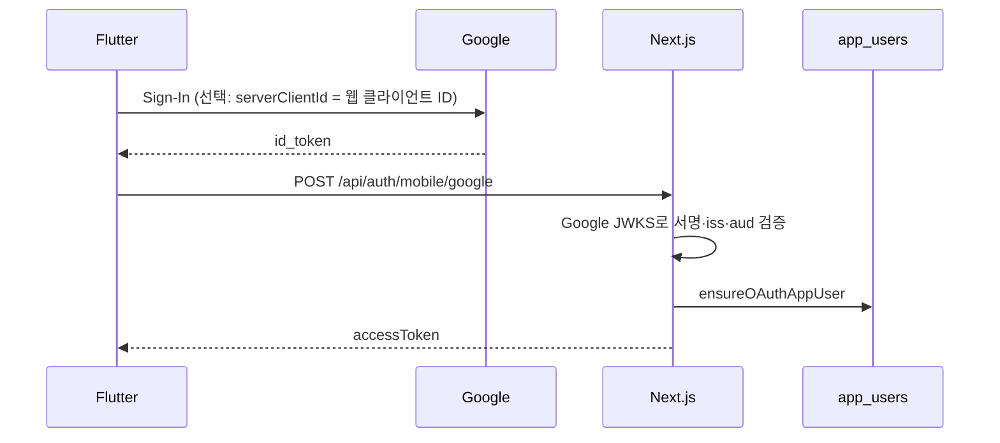

# 모바일 Google 로그인

Flutter 앱에서 Google 계정으로 로그인하고, 웹(NextAuth)과 **동일한 `app_users` 계정**으로 서버 세션을 맞추는 방법을 정리합니다.

## 흐름 요약

웹은 브라우저 OAuth(NextAuth)를 쓰고, 모바일은 **네이티브 `google_sign_in`**으로 ID 토큰을 받은 뒤, 서버가 토큰을 검증하고 **모바일 전용 JWT**(`signMobileAccessToken`)를 발급합니다.



- 사용자 생성·이메일 병합 로직은 웹 Google 로그인과 동일하게 **`ensureOAuthAppUser`** (`apps/web/src/lib/auth/app-users.ts`)를 사용합니다.
- 모바일이 API에 넘기는 토큰은 **NextAuth 세션이 아니라** `Authorization: Bearer <mobile JWT>` 용 액세스 토큰입니다.

## 서버 API

| 항목 | 내용 |
|------|------|
| 메서드·경로 | `POST /api/auth/mobile/google` |
| 본문 | `{ "idToken": "<Google ID 토큰 문자열>" }` |
| 성공 | `{ "accessToken": "<HS256 JWT>" }` |
| 구현 | `apps/web/src/app/api/auth/mobile/google/route.ts` |
| 토큰 검증 | `apps/web/src/lib/auth/verify-google-id-token.ts` (Google JWKS: `https://www.googleapis.com/oauth2/v3/certs`) |

### 서버 환경 변수

| 변수 | 용도 |
|------|------|
| `AUTH_GOOGLE_ID` | 웹 NextAuth용 웹 OAuth 클라이언트 ID. **모바일 ID 토큰의 허용 `aud`에 자동 포함**됩니다. |
| `AUTH_GOOGLE_MOBILE_AUDIENCES` | (선택) 추가 허용 `aud`. 콤마로 구분. Android 전용 클라이언트 ID만 토큰에 실리는 경우 등에 설정합니다. |

배포(Vercel 등)에 **`AUTH_GOOGLE_ID`가 없으면** 모바일 Google 엔드포인트는 **503**을 반환합니다.

루트 `.env.example`에도 같은 설명이 주석으로 있습니다.

## Google Cloud Console

### 클라이언트 유형

1. **웹 애플리케이션**  
   - NextAuth의 `AUTH_GOOGLE_ID` / `AUTH_GOOGLE_SECRET`  
   - 모바일에서 **`google_sign_in`의 `serverClientId`**로 **이 웹 클라이언트 ID**를 쓰면, ID 토큰의 `aud`가 서버의 `AUTH_GOOGLE_ID`와 맞춰져 설정이 단순해집니다.

2. **Android**  
   - 앱의 **패키지 이름** + **SHA-1**(디버그/릴리즈 각각) 등록  
   - 현재 저장소 기본값: `applicationId` 는 `app.bookfolio.android`, `namespace` 는 `app.seogadam.mobile` (`android/app/build.gradle.kts`). Google 콘솔 Android 클라이언트에는 **applicationId**(패키지명)를 등록합니다.

3. **iOS** (앱스토어 빌드 시)  
   - 별도 iOS OAuth 클라이언트 + `Info.plist` URL scheme 등 추가 작업이 필요합니다. 아래 [iOS](#ios) 참고.

### JSON 파일 이름과 시크릿

콘솔에서 내려받는 파일명이 `client_secret_<...>.apps.googleusercontent.com.json` 형태여도, **`client_secret_` 뒤의 긴 문자열은 클라이언트 ID에 가깝고, 파일 이름 자체가 “시크릿”은 아닙니다.**  
Android용 **installed** 타입 JSON에는 `client_secret` 필드가 없는 경우가 많습니다. **OAuth client secret은 모바일 앱에 넣지 않습니다.**

로컬에 둔 클라이언트 JSON은 Git에 올리지 마세요. 저장소에는 `scripts/client_secret*.json`을 무시하도록 `.gitignore`에 포함해 두었습니다.

### SHA-1 디지털 지문

Google이 Android 앱을 식별할 때 **패키지명 + 서명 키(SHA-1)** 조합을 사용합니다.

- **디버그**: 보통 `%USERPROFILE%\.android\debug.keystore`  
  `keytool -list -v -keystore ... -alias androiddebugkey -storepass android -keypass android`
- **Gradle**: `JAVA_HOME` 설정 후 `apps/mobile/android`에서 `./gradlew signingReport`
- PC에 `java`/`keytool`이 PATH에 없으면 Android Studio 번들 JBR 사용 예:  
  `C:\Program Files\Android\Android Studio\jbr\bin\keytool.exe`

출시·Play App Signing 키의 SHA-1은 디버그와 다릅니다. 스토어 빌드에서도 Google 로그인을 쓰면 **릴리즈(또는 Play가 서명하는 키) 지문**을 콘솔에 추가해야 합니다.

## 모바일 앱 설정

### `dart-define` (컴파일 타임)

Flutter는 런타임에 `.env`를 읽지 않습니다. 다음 값은 **`--dart-define`**으로 넣습니다.

| 키 | 설명 |
|----|------|
| `BOOKFOLIO_API_BASE_URL` | Next.js 배포 URL (끝 슬래시 없이). 예: `https://your-app.vercel.app` |
| `GOOGLE_AUTH_CLIENT_ID` | **권장:** `AUTH_GOOGLE_ID`와 **동일한 웹 OAuth 클라이언트 ID**. `google_sign_in`의 `serverClientId`로 전달됩니다. |

로컬 개발 예(에뮬레이터 → PC의 Next):

```bash
cd apps/mobile
flutter run \
  --dart-define=BOOKFOLIO_API_BASE_URL=http://10.0.2.2:30082 \
  --dart-define=GOOGLE_AUTH_CLIENT_ID=xxxx.apps.googleusercontent.com
```

### 루트 `.env.mobile` / 릴리스 빌드

`scripts/build-mobile.sh`는 셸에 `BOOKFOLIO_API_BASE_URL`이 없을 때 **루트 `.env.mobile`**을 `source`합니다.

- `BOOKFOLIO_API_BASE_URL` — 필수
- `GOOGLE_AUTH_CLIENT_ID` — 설정 시 `--dart-define=GOOGLE_AUTH_CLIENT_ID=...`로 빌드에 포함

예시는 `.env.mobile.example`을 참고하세요.

### 코드 위치

- 로그인·토큰 저장: `apps/mobile/lib/src/state/auth_controller.dart` (`signInWithGoogle`, `signOut` 시 `GoogleSignIn` 정리)
- UI: `apps/mobile/lib/src/ui/screens/sign_in_screen.dart`
- 의존성: `pubspec.yaml`의 `google_sign_in`

## iOS

iOS에서 Google 로그인을 쓰려면 보통 **iOS용 OAuth 클라이언트**와 **`Info.plist`의 URL Types**(reversed client id 스킴 등) 설정이 필요합니다.  
현재 `ios/Runner/Info.plist`에는 해당 스킴이 없을 수 있으므로, iOS 빌드 전에 [google_sign_in iOS 설정](https://pub.dev/packages/google_sign_in) 문서를 따라 추가하세요.

## 문제 해결

| 증상 | 점검 |
|------|------|
| API 503, Google 미설정 메시지 | 배포 환경에 `AUTH_GOOGLE_ID`(또는 필요 시 `AUTH_GOOGLE_MOBILE_AUDIENCES`) 설정 여부 |
| 401, 토큰 검증 실패 | ID 토큰 `aud`가 서버 허용 목록에 있는지. 웹 ID로 맞추려면 `GOOGLE_AUTH_CLIENT_ID` = `AUTH_GOOGLE_ID` |
| ID 토큰을 못 받음 | `GOOGLE_AUTH_CLIENT_ID` 미설정 시 기기/OS에 따라 `idToken`이 비는 경우가 있음. 웹 클라이언트 ID를 `serverClientId`로 지정 권장 |
| 디버그만 되고 릴리즈만 실패 | Google 콘솔에 **릴리즈 서명 SHA-1** 등록 여부 |
| 에뮬에서 API 연결 실패 | `localhost` 대신 `10.0.2.2:<포트>` 사용 여부 |

## 관련 파일 목록

| 경로 | 역할 |
|------|------|
| `apps/web/src/app/api/auth/mobile/google/route.ts` | 모바일 Google 로그인 API |
| `apps/web/src/lib/auth/verify-google-id-token.ts` | ID 토큰 JWT 검증 |
| `apps/web/src/lib/auth/google-mobile-audiences.ts` | 허용 `aud` 목록 |
| `apps/web/src/lib/auth/app-users.ts` | `ensureOAuthAppUser` |
| `apps/web/src/lib/auth/mobile-jwt.ts` | 모바일 액세스 토큰 발급 |
| `scripts/build-mobile.sh` | 릴리스 빌드 시 `dart-define` 주입 |
| `.env.example` / `.env.mobile.example` | 변수 예시 |

더 짧은 실행 요약은 **`apps/mobile/README.md`**의 Required env 섹션을 보시면 됩니다.
